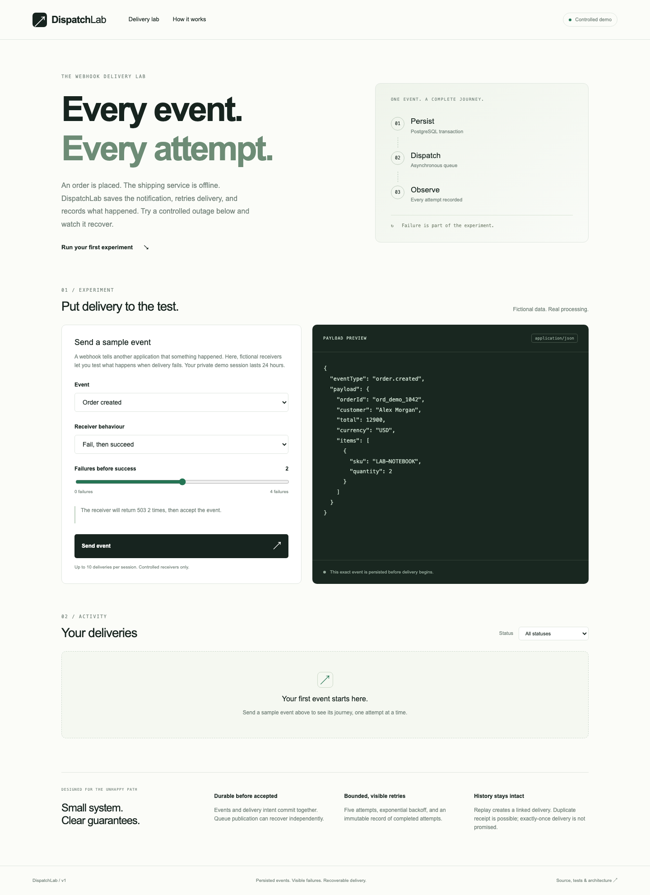

# DispatchLab

[](https://github.com/Nate100406/dispatchlab/actions/workflows/ci.yml)

A small webhook delivery and replay system built to make failure visible.

Imagine an online shop notifying a shipping service that an order was placed. If the shipping service is offline, DispatchLab saves the notification, retries it, and shows every result. The demo uses fictional receivers to make those outages repeatable.

Explore the delivery flow and its guarantees in the [five-minute walkthrough](docs/reviewer-walkthrough.md).



Submit a fictional event, watch controlled failures and signed retries, inspect every attempt, and replay without rewriting history. TypeScript, Next.js, PostgreSQL, Cloudflare Workers and one queue. No paid API, cloud account, or subscription is needed to run it locally.

## Try it locally

Requires Node.js 22.17+ (22 LTS), npm, Docker, and Docker Compose. Port 55439 is reserved for this project's database; 8787 for Workers; 3000/3001 for dashboard development.

```sh
npm ci
npm run db:up
npm run setup
npm run build
npm run serve
```

Open **http://localhost:8787**. Choose “Fail, then succeed” with two failures, then Send event. The timeline should show 503, 503, and 200. Try Always fail, then Replay to success to inspect preserved history.

For hot-reload development, use `npm run dev` instead of `npm run serve` and open **http://localhost:3000**. Its local reverse proxy keeps API calls on the same origin. Build once before first use because Wrangler serves the static export too.

Setup creates ignored `.env` and `.dev.vars` files from local-only examples and migrates both databases. The application uses a restricted runtime role; migration/setup uses the local owner. Docker data survives restarts. `docker compose down` stops the project; only add `--volumes` when deliberately resetting its local data.

## Verification

```sh
npx playwright install chromium
npm run check
```

`npm test`: retry/signature/receiver unit tests. `npm run test:integration`: real PostgreSQL transactions, independent concurrent connections, crash recovery, idempotency, replay, quotas, handlers, HTTP transport and timeout tests. `npm run test:e2e`: built static app + local emulated queue + verified receiver + real PostgreSQL. The test database must end in `_test`; it is truncated by integration tests. Do not point tests at a production database.

CI runs the same checks on pushes and pull requests, without cloud credentials. Browser traces and screenshots are uploaded on failure. Local queue emulation does not simulate consumer concurrency; separate database tests establish safe claiming.

## API example

Start a capability session, then submit a preset using the saved cookie:

```sh
curl -c /tmp/dispatchlab-cookies -H 'Origin: http://localhost:8787' \
  -H 'Content-Type: application/json' -d '{}' http://localhost:8787/api/session

curl -b /tmp/dispatchlab-cookies -H 'Origin: http://localhost:8787' \
  -H 'Content-Type: application/json' -H 'Idempotency-Key: order_example_001' \
  -d '{"sampleId":"order","receiver":{"behaviour":"fail_then_succeed","failures":2}}' \
  http://localhost:8787/api/events
```

The 202 response contains `eventId`, `deliveryId`, and `deduplicated`. Repeat the same request/key to get the same IDs; different content with that key returns 409. Local mode also accepts `eventType`/`payload` instead of `sampleId`; hosted mode accepts presets only. Destination URLs and arbitrary headers are never accepted.

| Endpoint                                | Purpose                                                                                   |
| --------------------------------------- | ----------------------------------------------------------------------------------------- |
| POST `/api/session`                     | Create/reuse anonymous session                                                            |
| POST `/api/events`                      | Atomically accept event and delivery intent                                               |
| GET `/api/deliveries?status=…&cursor=…` | Scoped cursor-paginated list                                                              |
| GET `/api/deliveries/:id`               | Event, delivery, attempts, linked replays                                                 |
| POST `/api/deliveries/:id/replay`       | Terminal replay; body `{"recover":false}` preserves behaviour, `true` switches to success |
| GET `/api/health`                       | Configuration health without a DB wake-up                                                 |

Both delivery-creating POSTs require an Idempotency-Key. POSTs require same-origin JSON. Errors include `code`, safe `message`, and `requestId`. 401 means the session is absent/expired; 404 includes inaccessible records; 429 identifies a quota/rate limit; 503 is retriable with the same key.

## Guarantees and limitations

- Acceptance means committed PostgreSQL state, not receiver success.
- Five attempts maximum; exponential jitter, bounded Retry-After, three-second timeout, no redirects.
- Database leases suppress ordinary concurrent sends and fence stale writes. Receiver acceptance followed by a lost result can still cause duplicate receipt.
- An interrupted attempt has an **unknown outcome**. No exactly-once or ordering guarantee.
- Replay preserves event ID/payload and old history; it creates a new delivery. Receiver business deduplication should use event ID.
- Hosted retention is 24 hours. Budget: 50 deliveries/day, 200 new sessions/day, 10 deliveries/session, two replays/event. Provider quotas can temporarily make the demo unavailable.
- Recovery runs every 30 minutes in bounded batches. Backlogs or infrastructure outages can require additional sweeps. Normal retries publish immediately.

## Engineering evidence

- [Architecture and decisions](docs/architecture.md): schema, transactions, state machine, signing, tradeoffs and exclusions.
- [Implementation phases](docs/implementation-plan.md): deliverables and gates.
- [Runbook](docs/runbook.md): provisioning, least privilege, deployment and recovery.
- [Reliability audit](docs/audit-2026-10-05.md): reproduced defects, fixes, regression evidence and remaining cloud checks.
- `packages/db/migrations`: schema constraints, immutable history and incremental migration.
- `tests/integration/system.test.ts`: races, partial failures and durable recovery.
- `tests/e2e/delivery.spec.ts`: a complete failure/recovery story.

MIT licensed. Hosted cloud provisioning and smoke verification are separate from local verification; no hosted deployment is implied by this repository.
