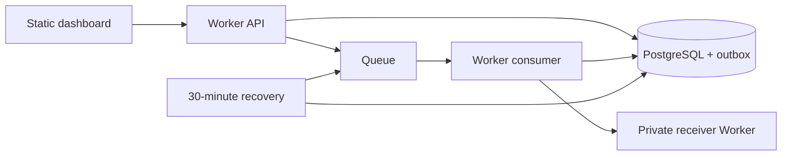

# DispatchLab v1 architecture

DispatchLab demonstrates reliable, inspectable webhook attempts. Hosted visitors submit fictional events to controlled receivers. Local clients can submit JSON; neither mode accepts destination URLs.

## Decisions

1. **Static Next.js + Worker API.** The dashboard is an App Router static export. One Worker serves assets, `/api/*`, the queue consumer, and scheduled recovery. This avoids SSR adapters and a third hosting provider. Runtime delivery IDs use `/deliveries/?id=…`.
2. **PostgreSQL is authoritative.** Events, delivery state, attempts, quotas, idempotency results, and outbox entries are relational records. Parameterised SQL and short transactions use `pg`. Hosted connections use the included Hyperdrive pool with query caching disabled. Foreground API operations share an invocation-scoped connection; background publication owns its connection lifetime. A timeline is read with one statement and one PostgreSQL snapshot. Queue messages contain only delivery ID and scheduling generation.
3. **Transactional outbox.** Ingestion and retry scheduling commit delivery intent before queue publication. Publication uses a 30-second lease and at most three tries per generation. A send/record crash can duplicate notifications; database claims suppress ordinary duplicate execution.
4. **Bounded at-least-once attempts.** No ordering or exactly-once guarantee. Receiver acceptance followed by a lost response can cause duplicate receipt. A 30-second execution lease and conditional finalisation fence stale database writes, not external effects.
5. **Private controlled receivers.** A second Worker is reachable only through an HTTP service binding (public and preview routes disabled). It verifies HMAC before determining behaviour from the signed attempt number. Actual TCP HTTP fixtures are also tested locally.
6. **Free-tier limits.** No always-on poller or keep-alive queries. Recovery runs every 30 minutes; active dashboard polling is bounded to three minutes. Use Neon Free, Workers Free, and the provided workers.dev address. Availability can degrade when provider quotas run out.

## Model and invariants

`demo_sessions` owns events. Immutable `events` contain JSONB. `deliveries` reference an event and optional replay parent; a composite FK requires the parent to reference that same event. `delivery_attempts` have unique per-delivery ordinals and at most one unfinished attempt; a trigger prevents rewriting completed history. `idempotency_requests` bind a session/operation/key to a canonical request fingerprint and result. `delivery_outbox` has one row per scheduling generation. `demo_daily_usage` enforces exact UTC admission limits.

Delivery states: `pending → in_progress → succeeded | retry_wait | dead_lettered`; `retry_wait → in_progress`. Expired leases mark unfinished attempts `interrupted` and schedule a new generation, or exhaust the attempt budget. Terminal states never become active. Replay creates a linked delivery with a fresh budget and preserves the event.

Ingestion locks session, idempotency scope, global quota, then creates event/delivery/outbox together. Duplicate matching requests return original IDs without consuming quota. Conflicting fingerprints return 409. Replay has a two-replay limit across the event's entire chain.

Claims lock a delivery, verify generation and persisted due time, allocate an ordinal and lease token, then commit **before HTTP**. Finalisation checks the lease token and expiry. Broker retries handle execution failures; persisted application schedules handle webhook failures. Infrastructure stalling becomes a durable final failure after bounded publication attempts and a grace period.

## Delivery policy

Five attempts; three-second timeout; no redirects. Retry connection errors, timeouts, 408, 429, and 5xx. Other non-2xx responses terminate. After failed attempt n, choose whole-second jitter from 1 through `min(30, 2^n)`. Valid Retry-After seconds/dates extend the delay, capped at 30 seconds. Persist the chosen due time once.

Receiver presets: 200; 503 for N attempts (N=0–4) then 200; always 503; four-second timeout; always 429 with Retry-After 5. Configuration is snapshotted and signed. Redrive means replaying a final failure; no separate broker DLQ is required.

## HMAC contract

Web Crypto HMAC-SHA256 signs UTF-8 `timestamp + "\n" + deliveryId + "\n" + attemptNumber + "\n" + rawBody`. Headers: `X-DispatchLab-Event`, `-Delivery`, `-Attempt`, `-Timestamp`, and `-Signature` (`v1=` followed by lowercase hex). The event header must equal the signed body's event ID. Verify exact bytes, UUID/ordinal shape, and a five-minute timestamp window with Web Crypto verification. Timestamp/signature are regenerated per attempt. The receiver source is the executable verifier example.

## Security and operations

Opaque 256-bit cookie; only its hash is stored. HttpOnly/SameSite=Strict and Secure when hosted. Same-origin JSON POSTs, session-scoped reads, no-store responses. 24-hour retention; 50 admitted deliveries and 200 new sessions per UTC day, 10 deliveries per session, five attempts, two replays. Rate bindings limit IP and session traffic before DB access (approximate, per location); SQL counters enforce exact work admission. The session admission cap keeps expired-row cleanup capacity ahead of admitted growth. Bodies ≤16 KiB, local payloads ≤8 KiB, response excerpts ≤2 KiB. No public fault injection, arbitrary URLs, HTML response rendering, or secret logging. Runtime database role cannot modify schema. DEMO_PAUSED is an emergency admission/read pause; in-flight bounded work still completes.

Recovery reconciles expired leases, republishes overdue notifications, and cleans expired sessions in bounded batches. Cascades delete their events/history/outbox. Retention defines the durability window. Unknown receiver outcomes remain explicit; expired records are acknowledged when encountered in the queue.

## References

- [Next.js static exports](https://nextjs.org/docs/app/guides/static-exports)
- [Workers database connectivity](https://developers.cloudflare.com/workers/databases/connecting-to-databases/)
- [Queue pricing and retention](https://developers.cloudflare.com/queues/platform/pricing/)
- [Local queue limitations](https://developers.cloudflare.com/queues/configuration/local-development/)
- [Rate binding accuracy](https://developers.cloudflare.com/workers/runtime-apis/bindings/rate-limit/)

Not in v1: accounts, API-key management, billing, teams, organizations, arbitrary destinations, subscriptions/fan-out/routing, bulk redrive, cancellation, ordering, exactly-once claims, secret rotation UI, WebSockets, Redis, Kubernetes, other languages, or AI.
